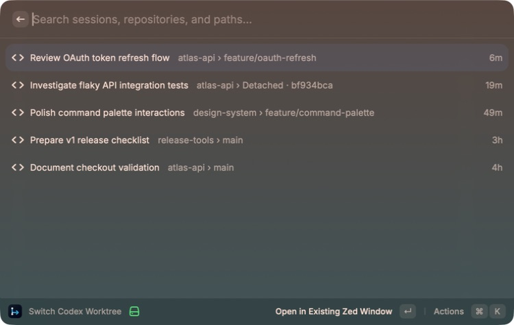

<!--
SPDX-FileCopyrightText: 2026 loheagn <loheagn@icloud.com>
SPDX-License-Identifier: MIT
-->

# Codex Worktree Switcher

[](https://github.com/loheagn/raycast-codex-worktree-switcher/actions/workflows/ci.yml)

[English](README.md) | 简体中文

一个本地优先的 macOS Raycast 扩展，用于查找 Codex Desktop 会话，并在 Zed 中打开对应的 Git checkout。



> [!NOTE]
> 这是非官方社区项目，与 OpenAI、Raycast 和 Zed Industries 没有关联，也未获得这些公司的背书。

## 功能

- 按最近活跃时间列出本机未归档的 Codex Desktop 会话。
- 展示会话标题与 `仓库 › 分支`；detached checkout 显示为 `Detached · <提交>`。
- 支持按会话标题、仓库、分支、提交标识和路径搜索。
- 默认在现有 Zed 窗口打开 checkout，也可以在新窗口打开。
- 支持复制 checkout 路径、在 Finder 中显示和手动刷新。
- 即使多个 Codex 会话共用同一 checkout，也会保留为独立条目。

## 环境要求

- macOS
- [Raycast](https://www.raycast.com/)
- Codex Desktop
- [Zed](https://zed.dev/)
- Git 与系统 SQLite CLI
- 从源码安装时需要 Node.js 22.22.2 或更高版本及 npm

## 从源码安装

本扩展目前未发布到 Raycast Store，需要克隆并在本机导入：

```bash
git clone https://github.com/loheagn/raycast-codex-worktree-switcher.git
cd raycast-codex-worktree-switcher
npm ci
npm run dev
```

Raycast 显示扩展就绪后，打开 Raycast 并运行 **Switch Codex Worktree**。首次导入完成后可以按 `Ctrl-C` 停止开发进程；只有修改扩展并需要热更新时才需要保持运行。

## 使用

列表不按仓库分组，而是按照 Codex 最近活跃时间进行全局排序。副标题用于标识 checkout：

- 有分支：`仓库 › feature/branch-name`
- detached：`仓库 › Detached · 398aecb5`

默认 Action 执行 `zed --existing <checkout>`。其他 Action 可以在新 Zed 窗口打开、复制路径、在 Finder 中显示、刷新列表或打开扩展偏好设置。

## 偏好设置

| 偏好       | 默认值        | 用途                         |
| ---------- | ------------- | ---------------------------- |
| Codex Home | `~/.codex`    | Codex Desktop 元数据所在目录 |
| Zed App    | `dev.zed.Zed` | 用于定位内置 CLI 的 Zed 应用 |

## 隐私与安全

扩展仅在本地运行，不发起网络请求，只读取以下生命周期与展示元数据：

- 会话 ID 与显示标题；
- 工作目录与来源类型；
- 归档状态与活跃时间；
- Git checkout 根目录、common directory、分支或 detached commit。

Codex SQLite 数据库通过 `/usr/bin/sqlite3` 打开，同时启用 `-readonly` 和 `PRAGMA query_only`。扩展不会查询 `preview`、`first_user_message`、rollout 路径、JSONL 或会话正文，也不会启动 Codex App Server、上传数据或创建缓存与会话历史。

每个 checkout 在展示前会通过 `/usr/bin/git` 验证，在打开 Zed 前会再次验证。所有外部命令均通过参数数组调用，并禁用 shell 执行。

安全问题请根据 [SECURITY.md](SECURITY.md) 私下报告。

## 筛选规则

列表只显示满足以下条件的会话：

- 属于当前本机用户且尚未归档；
- 对应目录仍然存在并且是本机 Git checkout；
- 来自受支持的顶层 Codex source；
- 能够通过兼容的 Codex 状态库验证。

主 checkout 和 linked worktree 都受支持。远程、SSH、容器、已删除及非 Git 目录会被隐藏。在无法验证归档状态前，仅存在于目录库中的记录不会显示。

## 排障

如果列表为空：

1. 至少启动一次 Codex Desktop，并确认其中存在本机会话。
2. 检查 **Codex Home** 偏好设置。
3. 确认会话尚未归档且目录仍存在。
4. 验证 checkout：

   ```bash
   /usr/bin/git -C /path/to/repository worktree list
   ```

扩展优先选择存在兼容候选的最高状态库版本；在该版本内，可读的根目录状态库具有权威性。只有该版本没有可读的根目录候选时，才会使用兼容的 legacy 状态库；如果没有可验证的候选，则停止加载并报错。如果无法打开 Zed，请在扩展偏好中重新选择 Zed 应用。

## 已知限制

- Codex Desktop 元数据表属于私有 schema，可能随时变化。
- legacy 元数据可能早于根目录状态库，因此只会在所选 schema 版本没有可读根目录候选时使用。
- Desktop 元数据库不包含 active/idle 状态，因此无法准确显示“工作中”标识。
- 扩展不会创建、修复、恢复、归档或删除 worktree 和 Codex 会话。
- 这是 Raycast 浮层命令，不是 Zed 内部常驻侧边栏。

## 开发

```bash
npm ci
npm run check
npm run dev
```

`npm run check` 会执行单元测试、TypeScript、Raycast lint、格式检查和生产构建。提交 Pull Request 前请阅读 [CONTRIBUTING.md](CONTRIBUTING.md)。

首次发布已在 macOS 26.6、Raycast 1.104.22、Codex Desktop 26.707.71524、Zed 1.10.3 以及 CI 中的 Node.js 22.22.2 上验证。

## 发布

GitHub Release 提供源码；Raycast 会在本机导入并构建扩展。版本说明记录在 [CHANGELOG.md](CHANGELOG.md)。

## 维护者

loheagn <loheagn@icloud.com>

## License

[MIT](LICENSE) © 2026 loheagn
